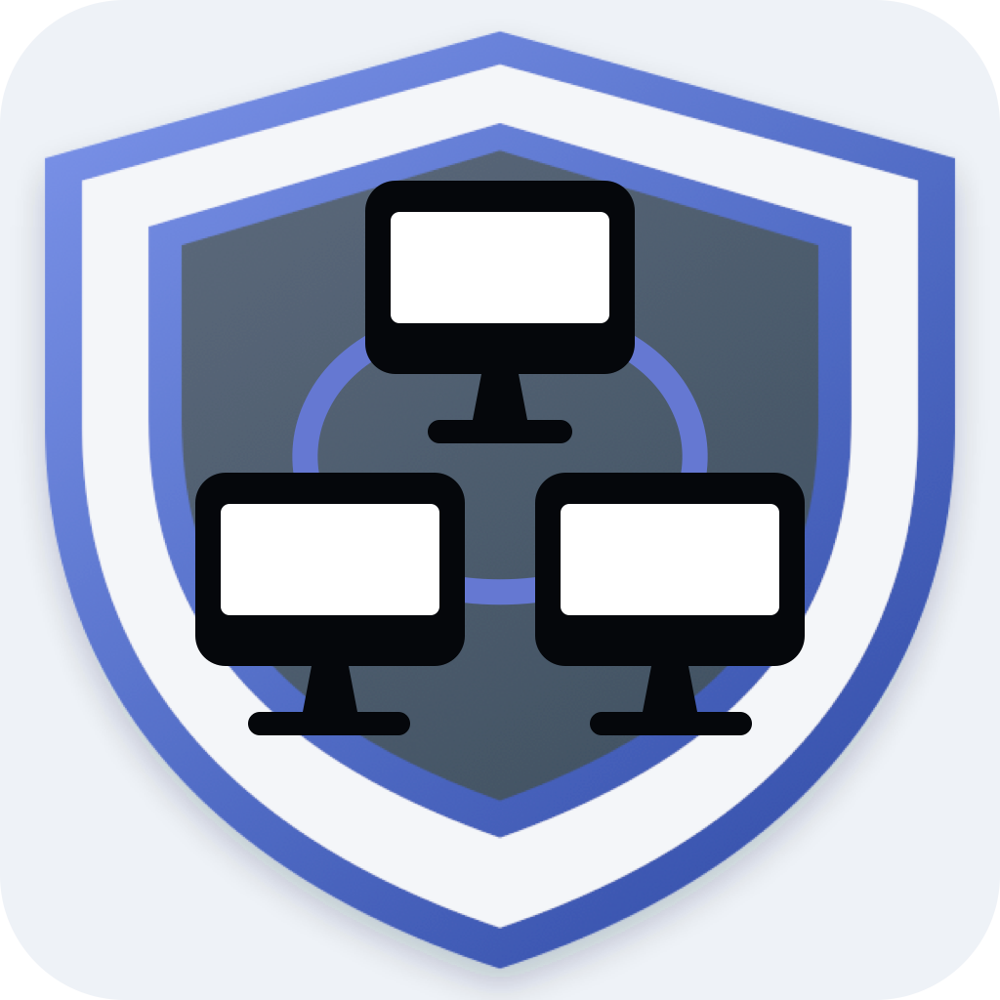
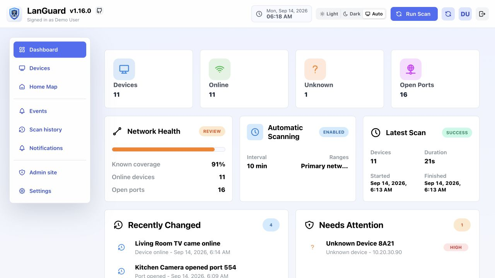
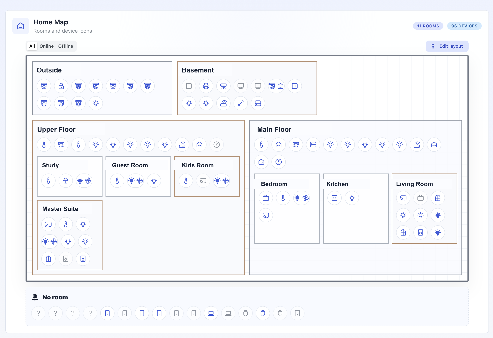

<p align="center">
  
</p>

<h1 align="center">LanGuard</h1>

<p align="center">
  Self-hosted network visibility for discovering, organizing, and monitoring devices on your LAN.
</p>

<p align="center">
  <a href="https://github.com/hillaliy/LanGuard/releases/latest">
    
  </a>
  <a href="https://github.com/hillaliy/LanGuard/pkgs/container/languard-backend">
    
  </a>
</p>

<p align="center">
  <a href="#features">Features</a> &middot;
  <a href="#portainer">Docker setup</a> &middot;
  <a href="macos/LanGuardMac/README.md">macOS</a> &middot;
  <a href="#migrate-from-watchyourlan">Migration</a> &middot;
  <a href="#license">License</a>
</p>

LanGuard finds devices, tracks online and offline state, scans common ports,
keeps network history, and can send Discord, Telegram, or automation webhook
alerts when new devices appear.

## Preview

### Dashboard

<p align="center">
  
</p>

### Home Map

<p align="center">
  
</p>

## Features

**Discover**

- Find LAN devices and identify their IP, MAC address, vendor, and hostname
- Track identity confidence, first and last seen times, and known or new state
- Detect local HTTP/HTTPS interfaces and common open ports

**Monitor**

- Track online and offline state, port changes, and device activity
- Compare completed scans and retain scan, event, and notification history
- Run scheduled scans after the configured interval

**Organize**

- Assign names, icons, rooms, roles, and expected device behavior
- Arrange rooms and devices in the Docker Home Map view
- Export and import device inventory between LanGuard installations

**Notify and integrate**

- Send Discord, Telegram, or generic webhook alerts for new devices and important changes
- Sync per-device DNS destinations and blocked-query totals from AdGuard Home
- Use Swagger, ReDoc, and the OpenAPI schema for integrations
- Create the initial administrator directly from first-user setup

## How scanning works

LanGuard combines several lightweight discovery methods to build and maintain
the device inventory:

| Method | Purpose |
| --- | --- |
| ARP discovery | Find active devices and their MAC addresses on the local network |
| Reverse DNS, mDNS, LLMNR, SSDP, and NetBIOS | Resolve hostnames and device metadata |
| OUI/manuf lookup | Identify hardware vendors from MAC addresses |
| TCP port checks | Track configured ports and detect service availability changes |
| ICMP and known-port confirmation | Avoid marking devices offline when they still respond outside ARP discovery |
| HTTP/HTTPS probing | Suggest a reachable local device-management interface |
| AdGuard Home sync | Collect aggregated per-device DNS destinations when the integration is enabled |

By default, LanGuard scans private IPv4 ranges and a limited set of configured
TCP ports. It does not capture packet contents or inspect application traffic,
and its recurring port checks are not a vulnerability assessment.

## Portainer

Use the included [`docker-compose.yaml`](docker-compose.yaml), or create a new Portainer stack and paste:

```yaml
services:
  backend:
    image: ghcr.io/hillaliy/languard-backend:latest
    container_name: languard-backend
    privileged: true
    network_mode: host
    environment:
      - SECRET_KEY=change-this-to-a-long-random-secret
      - ALLOWED_HOSTS=192.168.1.10,languard.local,127.0.0.1
      - BACKEND_LISTEN_PORT=${BACKEND_LISTEN_PORT:-8000}
    volumes:
      - languard_database:/data
      - languard_static:/static
    healthcheck:
      test: ["CMD", "python", "-c", "import os, urllib.request; port = os.environ.get('BACKEND_LISTEN_PORT', '8000'); urllib.request.urlopen(f'http://127.0.0.1:{port}/api/v1/health/', timeout=3).read()"]
      interval: 10s
      timeout: 5s
      retries: 6
      start_period: 60s
    restart: unless-stopped

  scanner:
    image: ghcr.io/hillaliy/languard-scheduler:latest
    container_name: languard-scanner
    privileged: true
    network_mode: host
    command: ["python", "-u", "manage.py", "run_scheduler", "--run-now"]
    environment:
      - SECRET_KEY=change-this-to-a-long-random-secret
      - ALLOWED_HOSTS=192.168.1.10,languard.local,127.0.0.1
    volumes:
      - languard_database:/data
      - languard_static:/static
    restart: unless-stopped
    depends_on:
      backend:
        condition: service_healthy
        restart: true

  frontend:
    image: ghcr.io/hillaliy/languard-frontend:latest
    container_name: languard-frontend
    network_mode: host
    environment:
      - BACKEND_UPSTREAM=127.0.0.1:${BACKEND_LISTEN_PORT:-8000}
      - FRONTEND_LISTEN_ADDRESS=:8080
    restart: unless-stopped
    depends_on:
      backend:
        condition: service_healthy
        restart: true

volumes:
  languard_database:
  languard_static:
```

> [!IMPORTANT]
> When upgrading an existing deployment to version 1.9.0 or newer, replace the
> `frontend` service in your Compose or Portainer stack with the definition
> above and recreate the stack once. The frontend now uses host networking and
> listens on `:8080` through `FRONTEND_LISTEN_ADDRESS`; remove its previous
> `ports` and `extra_hosts` entries. This does not change the database or static
> volumes, so stored LanGuard data is preserved.

The scanner uses its own `languard-scheduler` image. It does not call the web
backend, but both services share the database and schema, so Compose keeps their
startup and update order coordinated. Both images are built from the same LanGuard
source release and should be updated together. Always update and recreate the
backend, scheduler, and frontend containers as one release, even when the scheduler
service itself has no visible feature change.

The frontend uses host networking so it can reach the backend reliably at
`127.0.0.1:8000` without depending on Docker bridge routing. It listens on port
`8080` by default. To use another UI port, change `FRONTEND_LISTEN_ADDRESS`, for
example to `:8090`.

The backend listens on port `8000` by default. If that port is already used on
the Docker host, add `BACKEND_LISTEN_PORT=8010` under **Stack environment
variables** in Portainer before deploying or updating the stack. The Compose
definition applies that value to the backend server, its health check, and the
frontend proxy together. This is useful when Portainer's optional Edge Agent
tunnel already occupies port `8000`.

When hard-coding the value directly in YAML instead, set
`BACKEND_LISTEN_PORT: 8010` in the backend environment and
`BACKEND_UPSTREAM: 127.0.0.1:8010` in the frontend environment. Do not change
only the backend value, because the frontend proxy must use the same port. The
health check reads `BACKEND_LISTEN_PORT` automatically.

### Scheduler tasks

The scheduler container runs LanGuard's recurring background work:

| Task | Default schedule | Configuration |
| --- | --- | --- |
| Network scan | Immediately at startup, then 5 minutes after the previous scan completes | Scan interval in Settings |
| Failed notification retry | Every 15 minutes | `NOTIFICATION_RETRY_INTERVAL` |
| Activity cleanup | Every 24 hours | Activity retention in Settings |
| AdGuard Home sync | Every 5 minutes when enabled | AdGuard Home settings |

The scan range and scan interval are loaded when the scheduler starts, so restart
the scheduler container after changing either value. Activity retention and
AdGuard Home settings are read from the database during their scheduled loops and
do not require a restart.

> [!IMPORTANT]
> The next Docker release includes a Docker deployment change. Existing Compose
> files remain compatible, but installations should update the stack with the
> current Compose definition and recreate it once to enable the backend health
> check and coordinated service restarts. Named volumes are preserved, so this
> does not delete LanGuard data.

> [!IMPORTANT]
> When upgrading from version 1.4.0 or earlier, change the scanner service image
> from `ghcr.io/hillaliy/languard-backend` to
> `ghcr.io/hillaliy/languard-scheduler`, then pull and recreate the stack.

Change these before deploying:

- `SECRET_KEY`
- `ALLOWED_HOSTS`

Create a `SECRET_KEY` with:

```bash
openssl rand -base64 48
```

`ALLOWED_HOSTS` should include the IP or hostname you open in the browser. Keep
`127.0.0.1` for the container health check, for example:

```env
ALLOWED_HOSTS=192.168.1.10,languard.local,127.0.0.1
```

You normally do not need `CORS_ALLOWED_ORIGINS` in the Portainer stack. The frontend container serves the UI and proxies API requests to the backend on the same origin.

Open `http://<docker-host-ip>:8080` and create the first user. That user becomes admin. There is no default admin password.

After sign in, open Settings to change the scan range, scan interval, timezone, and notification channels.

The scanner waits for the configured scan interval after a scan completes before starting the next scheduled scan. For example, with a 5 minute interval, a scan that finishes at 20:14 will schedule the next scan for about 20:19.

### Support diagnostics

Admins can open **Settings > Maintenance** and select **Export diagnostics**
when reporting a problem. The JSON report includes the LanGuard version,
runtime and database details, configuration state, aggregate record counts,
and recent scan outcomes. It intentionally omits credentials, service URLs,
usernames, device names, IP and MAC addresses, network ranges, and raw exception
text. Attach this report to a GitHub issue; only provide container logs when
requested and review them for private network details first.

## AdGuard Home

Docker installations can sync AdGuard Home query-log activity into LanGuard.
LanGuard stores aggregated counters per device, domain, and DNS query type
instead of copying every raw DNS response. Old aggregates are removed using
the retention period configured in Settings.

1. Make sure the query log is enabled in AdGuard Home.
2. In LanGuard, open **Settings** and enable **AdGuard Home**.
3. Enter the AdGuard Home URL and credentials, then select **Test connection**.
4. Save Settings and select **Sync now** for the first import.
5. Open **DNS Activity** for a network-wide view, or open a device and select
   **DNS activity** for its destinations and blocked-query totals.

The central DNS Activity page includes search, allowed/blocked filtering,
device links, and diagnostics for AdGuard client identifiers that do not match
a current LanGuard device IP. Settings also provides separate manual cleanup
for DNS aggregates and unmatched-client diagnostics, including a **Clean all**
option.

The scheduler continues syncing at the configured interval. Update the
`languard-scheduler` image together with the backend and frontend whenever this
integration is included in a release.

> [!IMPORTANT]
> Per-device attribution requires AdGuard Home to record the device IP in the
> query log. If every DNS request is forwarded through the router and AdGuard
> Home only sees the router IP, LanGuard can only associate that activity with
> the router. Configure clients or DHCP to use AdGuard Home directly when you
> need device-level activity.

## Automation webhooks

LanGuard can send each enabled network event as structured JSON to n8n, Home
Assistant, or another automation service that accepts HTTP webhooks.

1. Create a webhook trigger in the automation service and copy its production URL.
2. In LanGuard, open **Settings > Notifications**.
3. Enable **Automation webhook**, paste the URL, and use the test action.
4. Save Settings and enable the event rules that should be delivered.

Event deliveries use this structure:

```json
{
  "source": "languard",
  "kind": "network_event",
  "event": {
    "id": 42,
    "type": "new_device",
    "label": "New device",
    "message": "Found new device Office laptop at 192.168.1.50",
    "created_at": "2026-08-31T08:15:00Z",
    "metadata": {}
  },
  "device": {
    "id": 12,
    "name": "Office laptop",
    "hostname": "office-laptop",
    "ip": "192.168.1.50",
    "mac": "02:00:00:00:00:12",
    "vendor": "Example Vendor",
    "role": "laptop",
    "room": "Office",
    "known": false,
    "online": true,
    "status": "online"
  },
  "scan_run_id": 18
}
```

The webhook follows the same event rules and quiet hours as Discord and
Telegram. A non-success HTTP response is recorded as a failed notification and
the scheduler retries it with the existing notification retry policy.

## Migrate from WatchYourLAN

LanGuard can import the current device inventory from
[WatchYourLAN](https://github.com/aceberg/WatchYourLAN). On the machine that can
reach WatchYourLAN, download the JSON returned by its documented `/api/all`
endpoint:

```bash
curl http://WATCHYOURLAN_IP:8840/api/all -o watchyourlan-devices.json
```

If WatchYourLAN is published through a reverse proxy, replace the URL with its
actual address and include the authentication options required by that proxy.

Then:

1. Sign in to LanGuard as an administrator.
2. Open **Settings**.
3. Under **WatchYourLAN migration**, select **Import from WatchYourLAN**.
4. Choose `watchyourlan-devices.json`.

LanGuard matches existing devices by MAC address and imports the device name,
DNS hostname, IP address, MAC address, hardware vendor, known state, online state,
and last-seen value. Invalid records are skipped and the completion notification
shows how many devices were created, updated, or skipped.

WatchYourLAN does not provide LanGuard rooms, roles, icons, comments, open-port
history, identity confidence, or Home Map layout through this endpoint. Configure
those fields in LanGuard after the migration; later scans can enrich hostname,
vendor, port, and status information. Scan history is intentionally not imported.

If you override `DISCORD_ICON_URL`, use a versioned URL when replacing the icon so Discord mobile clients do not reuse an old cached image, for example:

```env
DISCORD_ICON_URL=https://raw.githubusercontent.com/hillaliy/LanGuard/main/frontend/public/logo.png?v=current
```

Portainer will create the stack network automatically.

Backend and scanner use host networking so ARP discovery can see LAN devices. Without host networking, Docker bridge networking may only show the Docker host/gateway.

## Phone MAC Randomization

Modern iPhone and Android devices often use a private/random MAC address per Wi-Fi network. If that address changes, LanGuard will see the same phone as a new device.

For stable tracking, disable private/random MAC addressing for your home Wi-Fi network on the phone, or mark the new entry as known when it appears.

## Update

Change the image tags in the Portainer stack and redeploy. Do not delete the `languard_database` volume unless you want to reset LanGuard.

## API

- Swagger: `/api/schema/swagger/`
- ReDoc: `/api/schema/redoc/`
- Schema: `/api/schema/`

## Contributing

Development setup, checks, and release metadata instructions are documented in
[`CONTRIBUTING.md`](CONTRIBUTING.md).

## License

Copyright © 2026 Yossi Hillali.

LanGuard is licensed under the [Apache License 2.0](LICENSE). Third-party
components remain subject to their respective licenses.
